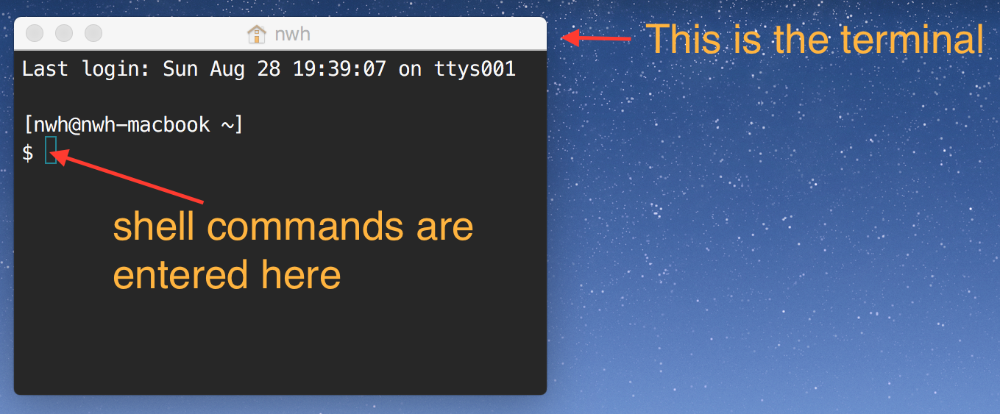

# CME211 Lecture 0 - Command Line

## Getting oriented

A command line interface (CLI) is a convenient and powerful way to interact with
a computer.  It often takes a bit of adjustment for a person who is used to
graphical user interfaces to get up and running with CLIs.  However, the
investment is always worth it.  CLIs make repetition and automation quite
simple.  It is much easier to send your colleague a shell command to achieve a
task compared to a sequence of GUI instructions.

First let's cover a few terms.

### Terminal

A **terminal**, **terminal emulator**, or **console** is a program that displays
text and handles input.  These programs emulate the behavior of physical
[computer terminals](https://en.wikipedia.org/wiki/Computer_terminal) (also
known as dumb terminals) in past computing systems.  Users of modern computing
systems often have many terminal windows open at once.  In the past, users were
limited to the physical terminal they sat behind.

On macOS, the built-in terminal program is called `Terminal.app`.  It is located
in `/Applications/Utilities`.  One convenient way to start the program is to
search for `terminal` using Spotlight.

### Shell

A **shell** is a program that executes commands from the user and displays the
result.  There are many different shell programs out there.  `bash` is quite
popular and is the default on macOS and most Linux distributions.  For a time,
`tcsh` was the default **sheel** on Farmshare systems.  Is is possible to change
the login shell with the `chsh` command.

## Moving around

* `pwd` - print working directory
* `cd` - change directory

Special directory aliases:

* `~` - user's home directory
* `..` - directory one higher in filesystem
* `.` - alias for working directory

## Looking at things

* `ls` - list files in directory
* `cat` - dump a file to terminal
* `less` - open file in a "pager"
* `file` - inspect file type

## Manipulating files

* `cp` - copy files and directories
* `mv` - move or rename files and directories
* `rm` - remove files and directories
* `touch` - create file or update timestamp
* `mkdir` - create directories

## Inspecting commands

* `type` - Display information about command type
* `which` - Locate a command
* `help` - Display reference page for shell builtin
* `man` - Display an on-line command reference

## Reading

* http://linuxcommand.org/lc3_learning_the_shell.php#contents
  * Read section 1, 2, 3, 5, and 6
  * Skip sections 4, 7 and above unless interested

## Resources

* <http://linuxcommand.org/>
* <http://www.pixelbeat.org/cmdline.html>
* <http://software-carpentry.org/>
  * <http://swcarpentry.github.io/shell-novice/>
  * <https://www.youtube.com/watch?v=hAHJ0xGKMBk>
