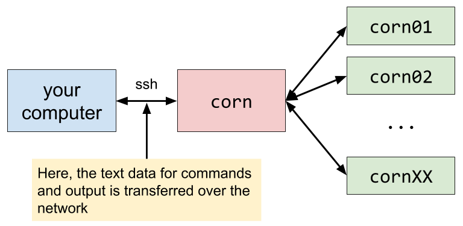

# CME211 Lecture 0 - Remote Computing

Often various resources (data, programs, high performance computing) are located
somewhere other than the computer we have in front of us.  There are many tools
and methods for accessing remote computing resources.  In CME211, we will use
`ssh` to access the shared computing resources managed by [Stanford Research
Computing][srcc].  In particular, we will be using the `corn` servers on
the [Farmshare][farmshare] system.

[srcc]: https://srcc.stanford.edu/
[farmshare]: https://web.stanford.edu/group/farmshare/cgi-bin/wiki/index.php/Main_Page

## Structure of `corn`

The `corn` servers are access through the address `corn.stanford.edu`.  The
"master node" is called `corn`.  This will send users to one of the worker
nodes, designated `cornXX` where `XX` is a number.

## Log into `corn` using `ssh`

## Transfer files to and from `corn` using `scp`

## Web utility

* Stanford WebAFS: <https://afs.stanford.edu/>

## Programs for macOS

* Built-in: use `ssh` from `Terminal.app`
* Fetch for file transfer: <https://uit.stanford.edu/software/fetch>

## Programs for Windows

* SecureCRT: <https://uit.stanford.edu/software/securecrt>
* SecureFX: <https://uit.stanford.edu/software/securefx>
* PuTTY: <http://www.chiark.greenend.org.uk/~sgtatham/putty/download.html>
* Bitvise SSH client: <https://www.bitvise.com/ssh-client>
