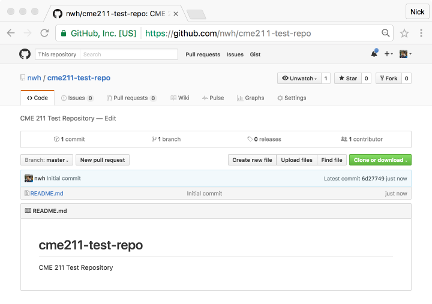
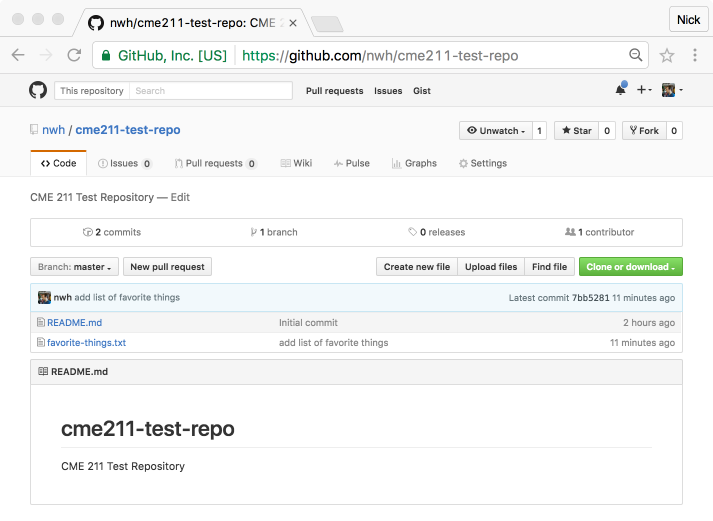

# CME211 Lecture 0 - Git and GitHub

*Git* is a software tool for managing changes, primarily in software development
projects.  There are many other tools for [version control][vc].  Git is
powerful, fast, and widely-used.

*GitHub* is a web-based service that hosts Git repositories and facilitates
collaboration of large teams.  [Bitbucket][bitbucket] and [GitLab][gitlab]
provide similar services.

[vc]: https://en.wikipedia.org/wiki/List_of_version_control_software
[bitbucket]: https://bitbucket.org/
[gitlab]: https://about.gitlab.com/

## Watch

Please watch the 4 introductory videos on the official `git` website:

* <https://git-scm.com/videos>

They will take about 25 minutes total and provide a decent orientation for the
motivation behind version control and `git`.

## Reading

From <https://git-scm.com/book/en/v2> read all of Chapter 1 and Chapter 2,
sections 1 to 5.

## Follow along for CME211

These instructions are focused on the use of `git` and GitHub for the purposes
of CME211.  Note that `nwh` is both my Stanford *and* GitHub username.  Thus,
`nwh` will be used in the demonstrations that follow.  You must replace `nwh`
with either your Stanford or GitHub username in the appropriate context.

## Obtain a GitHub account

1. Visit <https://github.com/> and sign up for a new account (if you don't
   already have one).
2. Visit <https://education.github.com/> to request an education discount which
   allows you to have unlimited private repositories while you are a student.
   Normal, free GitHub accounts grant users unlimited public repositories.

## Create a test repository in personal account on GitHub

* Visit <https://github.com/new> when logged into GitHub.

* Create a new repository with the following settings:
  * Repository Name: cme211-test-repo
  * Description: "CME211 Test Repository"
  * Select **Public**
  * Select **Initialize this repository with a README**


* After clicking "Create repository" you will be taken to the repository
  homepage:



* Click on the green "Clone or download" button to copy the repository link.


## Log in to `corn.stanford.edu` via `ssh` and configure `git`

Note: see [Farmshare two-factor authentication documentation][corn-2fa] to
configure more convenient access to `corn.stanford.edu` via SSH.

[corn-2fa]: https://web.stanford.edu/group/farmshare/cgi-bin/wiki/index.php/Main_Page#Duo_Two-Factor

```sh
# on host, log into corn
$ ssh nwh@corn.stanford.edu
# authenticate
# now on corn
[nwh@corn21 ~]
$ pwd
/afs/ir/users/n/w/nwh
```

We need to tell `git` who we are.  This is achieved with the following commands:

```sh
# on corn
$ git config --global user.name "John Doe"
$ git config --global user.email johndoe@example.com
```

Replace the name and email with your information.  It is also a good idea to
tell `git` which editor you want to use for commit messages.  For new users, I
recommend using `nano` for this purpose:

```sh
$ git config --global core.editor nano
```

These commands store information in the user's `git` configuration file, located
at `~/.gitconfig`.  You can inspect the contents of the file with `cat`.  Here
is mine:

```sh
$ cat ~/.gitconfig
[user]
	name = Nick Henderson
	email = nwh@stanford.edu
[core]
	editor = nano
```

See: <https://git-scm.com/book/en/v2/Getting-Started-First-Time-Git-Setup>

## Clone the test repository

When logged into `corn`, **clone** the repository you just created.  It is easiest
to copy the HTTPS link from the repository homepage.  Here is a log of the
process:

```sh
# on corn.stanford.edu
$ pwd
/afs/ir/users/n/w/nwh
$ ls
WWW  bin  config
$ git clone https://github.com/nwh/cme211-test-repo.git
Cloning into 'cme211-test-repo'...
remote: Counting objects: 3, done.
remote: Total 3 (delta 0), reused 0 (delta 0), pack-reused 0
Unpacking objects: 100% (3/3), done.
Checking connectivity... done.
$ ls
WWW  bin  cme211-test-repo  config
```

## Add a new text file

Go into the `cme211-test-repo` directory and use a text editor (e.g. `nano`) to
create a file called `favorite-things.txt`:

```sh
$ pwd
/afs/ir/users/n/w/nwh
$ cd cme211-test-repo/
$ ls
README.md
$ nano favorite-things.txt
# add some favorite things to the text file
$ ls
README.md  favorite-things.txt
# we can use cat to print the text file to the terminal
$ cat favorite-things.txt
pac-man
swimming
naps
2048
cycling
pop corn
olive oil
coffee
```

## Add file to repo, commit changes, push to GitHub

Check the **status** of the repository:

```sh
$ git status
On branch master
Your branch is up-to-date with 'origin/master'.

Untracked files:
  (use "git add <file>..." to include in what will be committed)

	favorite-things.txt

nothing added to commit but untracked files present (use "git add" to track)
```

**Add** the file to the repository:

```sh
$ git add favorite-things.txt
$ git status
On branch master
Your branch is up-to-date with 'origin/master'.

Changes to be committed:
  (use "git reset HEAD <file>..." to unstage)

	new file:   favorite-things.txt
```

**Commit** changes to repo with a commit message:

```sh
$ git commit -m "add list of favorite things"
[master 7bb5281] add list of favorite things
 1 file changed, 9 insertions(+)
 create mode 100644 favorite-things.txt
```

**Push** the change up to GitHub (will need to authenticate):

```sh
$ git push origin master
Username for 'https://github.com': nwh
Password for 'https://nwh@github.com':
Counting objects: 4, done.
Delta compression using up to 8 threads.
Compressing objects: 100% (3/3), done.
Writing objects: 100% (3/3), 357 bytes | 0 bytes/s, done.
Total 3 (delta 0), reused 0 (delta 0)
To https://github.com/nwh/cme211-test-repo.git
   6d27749..7bb5281  master -> master
```

In the above command:

* `origin` is the name of the remote repository
  (`https://github.com/nwh/cme211-test-repo.git` in my case, see `$ git remote
  -v`)

* `master` is the name of the remote branch you want to push to.  For CME211 we
  will use the default name `master` for the local and remote branch we work in.
  (You can list all branches with `$ git branch -av`.)

## Modify file on GitHub, pull to `corn`

Now visit the webpage for your test repository.  If everything went well, you
will see `favorite-things.txt` in the list of files.  My page looks like this:



Use the GitHub interface to edit `favorite-things.txt` and create a new file.
I will call my new file `least-favorite-things.txt`.

Go back to your `corn` terminal (or log back in if needed).  **Pull** the
changes you made up on GitHub to your repository on `corn`:

```sh
$ pwd
/afs/ir/users/n/w/nwh/cme211-test-repo
$ git pull
remote: Counting objects: 3, done.
remote: Compressing objects: 100% (3/3), done.
remote: Total 3 (delta 0), reused 0 (delta 0), pack-reused 0
Unpacking objects: 100% (3/3), done.
From https://github.com/nwh/cme211-test-repo
   7bb5281..f091800  master     -> origin/master
Updating 7bb5281..f091800
Fast-forward
 least-favorite-things.txt | 4 ++++
 1 file changed, 4 insertions(+)
 create mode 100644 least-favorite-things.txt
$ ls
README.md  favorite-things.txt	least-favorite-things.txt
$ cat least-favorite-things.txt
butter
mayonnaise
superlatives
fettuccine alfredo
```

Type `$ git log` to view the commit history.

## Note on merging

Things can get complicated when changes are made to the same file in parallel at
different locations (e.g. `corn` and GitHub).  The result of this will be errors
on a `push` or merge conflicts on a `pull`.  We will discuss this issue in more
detail in a future set of notes.  For now, take care to not update your
repository in more that one location with out syncing up.

## Warning: Dropbox

Maintaining a Git repository inside of Dropbox (or any other file syncing
service) often leads to a corrupt Git repository.  It is best to maintain your
local git repositories outside of any automatically synced folder.

## Summary

This set of notes covered the main features of Git that are required for CME211.
These are:

* Creating a new repository (not actually needed, because HW0 will automatically
  generate an empty repo for CME211 homeworks)
* Configuring with `$ git config`
* Cloning (getting a fresh copy) a repo with `$ git clone`
* Checking repository status with `$ git status`
* Adding and committing a new file with `$ git add` and `$ git commit`
* Pushing to GitHub with `$ git push`
* Pulling remote changes with `$ git pull`

If you want to learn more, please visit the links provided below.

## Resources

* <https://git-scm.com/documentation>
* <https://try.github.io/>
* <http://gitref.org/>
* <http://software-carpentry.org/>
  * <http://swcarpentry.github.io/git-novice>
  * <https://www.youtube.com/watch?v=hKFNPxxkbO0>
