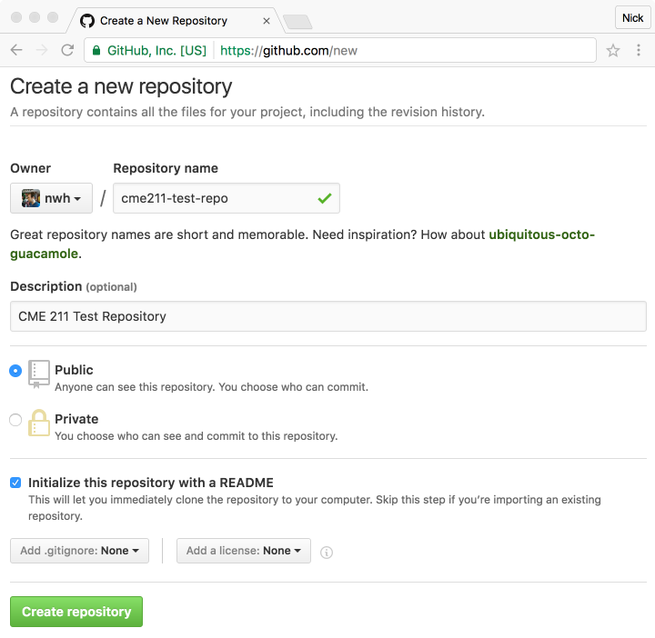
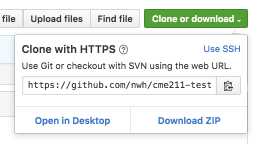

# CME211 Lecture 0 - Git

## Watch

Please watch the 4 introductory videos on the official `git` website:

* <https://git-scm.com/videos>

The will take about 25 minutes total and provide a decent orientation for the
motivation behind version control and `git`.

## Reading

From <https://git-scm.com/book/en/v2> read all of Chapter 1 and Chapter 2,
sections 1 to 5.

## Follow along for CME211

These instructions are focused on the use of `git` and GitHub for the purposes
of CME211. Pointers to other material and resources for deeper coverage.  Note
that `nwh` is both my Stanford *and* GitHub username.  Thus, `nwh` will be used
in the demonstrations that follow.  You must replace `nwh` with either your
Stanford or GitHub username in the appropriate context.

For CME211 we need to do the following:

## Obtain a GitHub account

1. Visit <https://github.com/> and sign up for a new account (if you don't
   already have one).
2. Visit <https://education.github.com/> to request an education discount which
   allows you to have unlimited private repositories while you are a student.
   Normal, free GitHub accounts grant users unlimited public repositories.

## Create a test repository in personal account on GitHub

* Visit <https://github.com/new> when logged into GitHub.

* Create a new repository with the following settings:
  * Repository Name: cme211-test-repo
  * Description: "CME211 Test Repository"
  * Select **Public**
  * Select **Initialize this repository with a README**



* After clicking "Create repository" you will be taken to the repository
  homepage:


* Click on the green "Clone or download" button to copy the repository link.



## Log in to `corn.stanford.edu` via `ssh` and configure `git`

```sh
# on host, log into corn
$ ssh nwh@corn.stanford.edu
# authenticate
# now on corn
[nwh@corn21 ~]
$ pwd
/afs/ir/users/n/w/nwh
```

We need to tell `git` who we are.  This is achieved with the following commands:

```sh
# on corn, or where ever you want to use git
$ git config --global user.name "John Doe"
$ git config --global user.email johndoe@example.com
```

Replace the name and email with your information.  It is also a good idea to
tell `git` which editor you want to use for commit messages.  For new users, I
recommend using `nano` for this purpose:

```sh
$ git config --global core.editor nano
```

These commands store information in the user's `git` configuration file, located
at `~/.gitconfig`.  You can inspect the contents of the file with `cat`.  Here
is mine:

```sh
$ cat ~/.gitconfig
[user]
	name = Nick Henderson
	email = nwh@stanford.edu
[core]
	editor = nano
```

See: <https://git-scm.com/book/en/v2/Getting-Started-First-Time-Git-Setup>

## Clone the test repository

When logged into `corn`, clone the repository you just created.  It is easiest
to copy the HTTPS link from the repository homepage.  Here is a log of the
process:

```sh
# on corn.stanford.edu
$ pwd
/afs/ir/users/n/w/nwh
$ ls
WWW  bin  config
$ git clone https://github.com/nwh/cme211-test-repo.git
Cloning into 'cme211-test-repo'...
remote: Counting objects: 3, done.
remote: Total 3 (delta 0), reused 0 (delta 0), pack-reused 0
Unpacking objects: 100% (3/3), done.
Checking connectivity... done.
$ ls
WWW  bin  cme211-test-repo  config
```

## Add a new text file
## Add file to repo, commit changes, push to GitHub
## Modify file on GitHub, pull to `corn`
## Note on merging
## Summary
## Warning

Dropbox can corrupt a git repository.

## Resources

* <https://git-scm.com/documentation>
* <https://try.github.io/>
* <http://gitref.org/>
* <http://software-carpentry.org/>
  * <http://swcarpentry.github.io/git-novice>
  * <https://www.youtube.com/watch?v=hKFNPxxkbO0>
