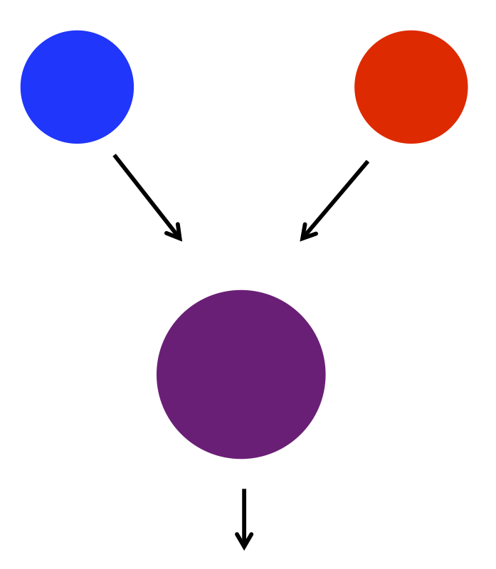
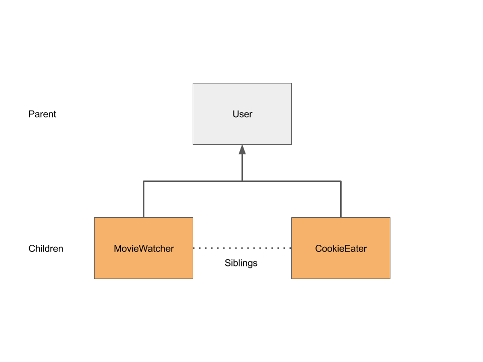

## Python OOP topics & examples

### Name example

```python
class NameClassifier:
    def __init__(self, femalefile, malefile):
        self.load_name_data(femalefile, malefile)

    def load_name_data(self, femalefile, malefile):
        # Creates a dictionary with the name data from the two input files
        self.namedata = {}
        f = open(femalefile,'r')
        for line in f:
            self.namedata[line.split()[0]] = 1.0
        f.close()

        f = open(malefile,'r')
        for line in f:
            name = line.split()[0]
            if name in self.namedata:
                # Just assume a 50/50 distribution for names on both lists
                self.namedata[name] = 0.5
            else:
                self.namedata[name] = 0.0
        f.close()

    def classify_name(self, name):
        if name in self.namedata:
            return self.namedata[name]
        else:
            # Don't have this name in our data
            return 0.5
```

```python
# Create an instance of the name classifier
classifier = NameClassifier('dist.female.first', 'dist.male.first')

# Setup test data
testdata = ['PETER', 'LOIS', 'STEWIE', 'BRIAN', 'MEG', 'CHRIS']

# Invoke the classify_name() method
for name in testdata:
    print('{}: {}'.format(name, classifier.classify_name(name)))
```

### Student example

Let's inspect review the `Student` object example from lecture 8:

```python
import copy

class Student:
    def __init__(self, id):
        self._id = id
        self._gpa = 0.0
        self._courses = {}
    def get_id(self):
        return self._id
    def add_course(self, name, gradepoint):
        self._courses[name] = gradepoint
        sumgradepoints = float(sum(self._courses.values()))
        self._gpa = sumgradepoints/len(self._courses)
    def get_gpa(self):
        return self._gpa
    def get_courses(self):
        return copy.deepcopy(self._courses)

s = Student(7)
s.add_course("gym", 4)
s.add_course("math", 3)

print("s = {}".format(s))

# lots of print statements to get information
print(s.get_id())
print(s.get_courses())
print(s.get_gpa())
```

### Operator overloading

* Your user defined objects can be made to work with the Python built-in
  operators

* Why would you want to do that?

### String representation method

We add a `__repr__()` method:

```python
class Student:
    def __init__(self, id):
        self._id = id
        self._gpa = 0.0
        self._courses = {}
    def get_id(self):
        return self._id
    def add_course(self, name, gradepoint):
        self._courses[name] = gradepoint
        sumgradepoints = float(sum(self._courses.values()))
        self._gpa = sumgradepoints/len(self._courses)
    def get_gpa(self):
        return self._gpa
    def get_courses(self):
        return copy.deepcopy(self._courses)
    def __repr__(self):
        string = "Student %d: " % self.get_id()
        string += " %s, " % self.get_courses()
        string += "GPA = %4.2f" % self.get_gpa()
        return string

s = Student(7)
s.add_course("gym", 4)
s.add_course("math", 3)

# now easy to print a student
print(s)
```

### Methods you can override

```
| method               | operation                  |
|----------------------+----------------------------|
| __len__(self)        | Returns the length of self |
| __add__(self, other) | Returns self + other       |
| __mul__(self, other) | Returns self * other       |
| __neg__(self)        | Returns -sefl              |
| __abs__(self)        | Returns abs(self)          |
| __float__(self)      | Returns float(self)        |
... many more ...
```

Over 50+ methods in total

### What is OOP?

* Some will argue that putting your data in an object, and adding a bunch of put
/ get methods to interface with it, is just a glorified container and interface

* Real power of OOP might be in allowing objects to interact with each other by
overriding appropriate methods

### Particle collision



### OOP design

```
p_blue = Particle(...)
p_red = Particle(...)

...

p_purple = p_blue + p_red
```

### Particle class

```python
class Particle:
    def __init__(self, mass, velx):
        self.mass = mass
        self.velx = velx
    def __add__(self, other):
        # inelastic collision (momentum is conserved)
        mass = self.mass + other.mass
        velx = (self.mass*self.velx + other.mass*other.velx)/mass
        return Particle(mass, velx)
    def __repr__(self):
        return "Mass: %s, Velocity: %s" % (self.mass, self.velx)
```

OOP particle collision:

```python
p_blue = Particle(4.3, 2.5)
p_red = Particle(1.4, -0.8)
p_purple = p_blue + p_red
p_purple
```

### Overloading should be intuitive

This is not a good idea:

```python
class User:
    def __init__(self, id):
        self.id = id
    def __len__(self):
        return self.get_id()
    def get_id(self):
        return self.id
```

Now:

```python
user = User(7)
len(user)
```

Is this intuitive?  Does this behave in a way a reasonable Python programmer
would expect?

### Inheritance

* Inheritance is a way for a class to inherit attributes from another class

* This is a form of code reuse

* The original class is called a base class, or a superclass, or a parent class

* The new class is called a derived class, or a subclass, or a child class

* The new class will typically redefine or add new attributes

### Inheritance example

```python
# parent class
class User:
    def __init__(self, id):
        self.id = id
    def get_id(self):
        return self.id

# child class
class MovieWatcher(User):
    pass
```

Let's use it:

```python
m = MovieWatcher(3)
m.get_id()
```

### Overriding a method

We can overrite the `__init__` method to provide special functionality when
creating a `MovieWatcher` object.

```python
class User:
    def __init__(self, id):
        self.id = id
    def get_id(self):
        return self.id

class MovieWatcher(User):
    def __init__(self, id):
        # Call the parent class initialization
        User.__init__(self, id)
        # MovieWatcher specific initialization
        self.avgmovieranking = -1.
        self.movies = {}
```


### Sibling classes

Multiple classes can inherit from a base class:

```python
class User:
    def __init__(self, id):
        self.id = id
    def get_id(self):
        return self.id

class MovieWatcher(User):
    def __init__(self, id):
        # Call the parent class initialization
        User.__init__(self, id)
        # MovieWatcher specific initialization
        self.avgmovieranking = -1.
        self.movies = {}

class CookieEater(User):
    def __init__(self, id):
        # Call the parent class initialization
        User.__init__(self, id)
        # CookieEater specific initialization
        self.cookieseaten = 0
        self.cookies = {}
```



### Polymorphism

* Different types of objects have methods with the same name that take the same
arguments

* Programmer does not need to know the exact type of an object for common
operations

* Typically the objects inherit from the same parent class

### Shapes

`code/shapes.py`:

```python
import math

class Shape:
    def GetArea(self):
        raise RuntimeError("Not implemented yet")

class Circle(Shape):
    def __init__ (self, x, y, radius):
        self.x = x
        self.y = y
        self.radius = radius

    def GetArea(self):
        area = math.pi * math.pow(self.radius, 2)
        return area

class Rectangle(Shape):
    def __init__ (self, x0, y0, x1, y1):
        self.x0 = x0
        self.y0 = y0
        self.x1 = x1
        self.y1 = y1

    def GetArea(self):
        xDistance = self.x1 - self.x0
        yDistance = self.y1 - self.y0
        return abs(xDistance * yDistance)
```

```python
shapes = []
shapes.append(Circle(0., 0., 1.0))
shapes.append(Rectangle(0., 0., 2., 4.))

for shape in shapes:
    print("area = {}".format(shape.GetArea()))
```


### OOP Summary

* Abstraction

* Represent things in a form familiar to humans

* Encapsulation

* Restrict access to internal data by providing interfaces

* Inheritance

* Parent / child classes for code reuse

* Polymorphism

* Share method names and arguments across (sibling) classes
