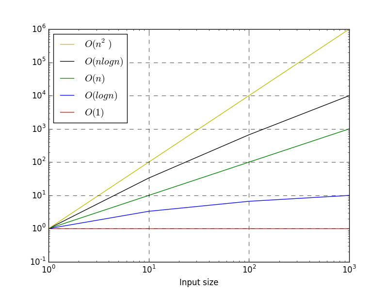
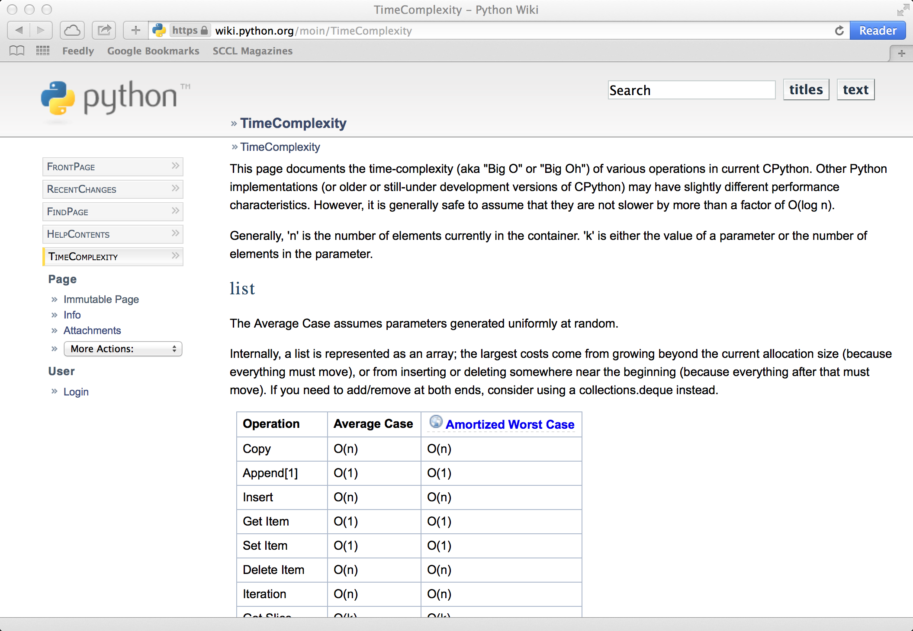
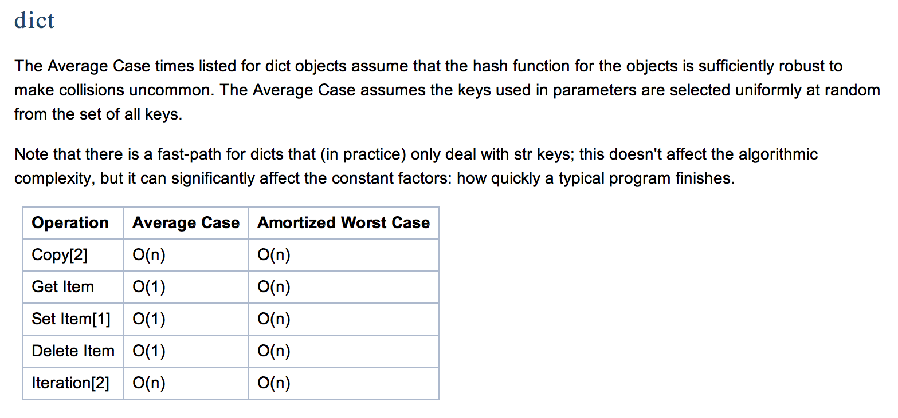

# CME 211 Lecture 6: Complexity Analysis

## Analysis of algorithms

Key questions when considering the performance of algorithms:

* **Time complexity**: How does the number of operations in an algorithm scale
  with the size of the input?

* **Space complexity**: How do the storage requirements of the algorithm scale?

## Empirical approach

Let's measure the running time of Pythons `sort` method on a random list of
integers.  See `code/listsort.py`.  Here is the code modified to suit the
notebook:

```python
import random
import sys
import time
```

```python
n = 1000

# Setup a list of random values and record the time required to sort it
v = random.sample(range(n), n)
t0 = time.time()
v.sort()
t1 = time.time()

print("Sorting {} values took {:.3} seconds.".format(n, t1-t0))
```

## Empirical approach

Let's run the script with increasing list length:

```
$ python3 listsort.py
Usage:
 listsort.py nvalues
$ python3 listsort.py 1000000
Sorting %d values took %.3f seconds.
$ python3 listsort.py 2000000
Sorting 2000000 values took 1.12 seconds.
$ python3 listsort.py 4000000
Sorting 4000000 values took 2.49 seconds.
$ python3 listsort.py 8000000
Sorting 8000000 values took 5.41 seconds.
$ python3 listsort.py 16000000
Sorting 16000000 values took 11.9 seconds.
```

## Problems with empirical

Empirical performance testing is an important endeavor.  It is an apect of
"profiling" your code to see what parts take longer.  Empirical performance
testing has some drawbacks, namely:

* Results are computer dependent

* You need to have the code before you can do the analysis

## Time complexity

* Estimate of the number of operations as a function of the input size (usually
  denoted as `n`)

* Input size examples:

  * length of list

  * for an `m` by `m` matrix, we say the input size is `m` even though the
      matrix as `m^2` entries

  * number of non-zero entries in a sparse matrix

  * number of nodes in a graph or network structure

* Typically characterized in terms of Big O notation, e.g. an algorithm is
  `O(n log n)` or `O(n^2)`.

```
| order notation | in English          |
|----------------+---------------------|
| O(1)           | Constant time       |
| O(log n)       | Logarithmic time    |
| O(n)           | Linear time         |
| O(n log n)     | Linearithmitic time |
| O(n^2)         | Quadratic time      |
```

## Visualization



## Big O notation

* Big O notation represents growth rate of a function in the limit of argument
  going to infinity

* Excludes coefficients and lower order terms

```
2n^22 + 64n -> O(n^2)
```

* Often some simplifying assumptions will need to be made about the nature of
  the input data in order to carry out analysis

## Linear algebra examples

* Adding two vectors? `O(n)`

```py
# c = a + b
# assume all the same length
n = len(a)
for i in xrange(n):
    c[i] = a[i] + b[i]
```

* Multiplying two matrices? Assuming the matrices are both `n x n`, it's
  `O(n^3)`

```py
# assume all matrices are n x n
# indexing notation below comes from numpy
# this will not work with standard python
# C = A*B
for i in xrange(n):
    for j in xrange(n):
        C[i,j] = 0
        for k in xrange(n):
            C[i,j] += A[i,k]*B[k,j]
```


Computing one value in the output matrix requires `O(n)`
operations, and there are `n^2` values in the output matrix.

## Linear search

*Linear search* is searching through a sequential data container for a specified
item.  An example of this is finding the start index of a given sub-string in a
longer string.

Exercise: Find the number `x` in your data:

```
|---+----+-----+----+-----+----+-----+-----|
| 4 | 17 | 100 | 73 | 120 | 42 | 999 | -17 |
|---+----+-----+----+-----+----+-----+-----|
```

Is it `O(1)`, or `O(n)`, or something else?

## Linear search: best and worst case

```
|---+----+-----+----+-----+----+-----+-----|
| 4 | 17 | 100 | 73 | 120 | 42 | 999 | -17 |
|---+----+-----+----+-----+----+-----+-----|

  ^                                     ^
  |                                     |
 O(1)                                  O(n)
```

* Best case: `x = 4` and we find the index with only one comparison

* Worst case: `x = -17` and we scan the entire list to find the last element

## Linear search: average case

```
|---+----+-----+----+-----+----+-----+-----|
| 4 | 17 | 100 | 73 | 120 | 42 | 999 | -17 |
|---+----+-----+----+-----+----+-----+-----|

                    ^
                    |
                  O(n/2)
```

Given random data and a random input (in the range of the data) we can **on
average** expect to search through half of the list.  This would be `O(n/2)`.
Remember that Big O notation is not concerned with constant terms, so this
becomes `O(n)`.

## Binary search algorithm

I we know that the list is sorted, we can apply binary search.  Let's look at an example

**Goal**: Find the index of `17` in the following list:

```
|-----+---+----+----+----+-----+-----+-----|
| -17 | 4 | 17 | 42 | 73 | 100 | 120 | 999 |
|-----+---+----+----+----+-----+-----+-----|
```

Start by looking half way through the list:

```
|-----+---+----+----+----+-----+-----+-----|
| -17 | 4 | 17 | 42 | 73 | 100 | 120 | 999 |
|-----+---+----+----+----+-----+-----+-----|
                  ^
                  U
```

`42` is not `17`, but `42` is greater than `17` so continue searching the left
(lower) part of the list.  The index associated with `42` becomes an upper bound
on the search.

```
|-----+---+----+----+----+-----+-----+-----|
| -17 | 4 | 17 | 42 | 73 | 100 | 120 | 999 |
|-----+---+----+----+----+-----+-----+-----|
        ^         ^
        L         U
```

`4` is not `17`, but `4` is less than `17` so continue searching to the right
part of the list up to the upper bound.  Turns out in this example that we only
have one entry to inspect:

```
|-----+---+----+----+----+-----+-----+-----|
| -17 | 4 | 17 | 42 | 73 | 100 | 120 | 999 |
|-----+---+----+----+----+-----+-----+-----|
        ^   ^     ^
        L   *     U
```

We have found `17`.  It is time to celebrate and return the index of `2`.
(Remember Python uses 0-based indexing.)

## Summary: Binary search

* Requires that the data first be sorted, but then:

  * Best case: `O(1)`

  * Average case: `O(log n)`

  * Worst case: `O(log n)`

## Sorting algorithms

There are many sorting algorithms and this is a worthy area of study.  Here are
few examples of names of sorting algorithms:

* Quicksort

* Merge sort

* Heapsort

* Timsort

* Bubble sort

* Radix sorts

* Etc.

The internet is full of examples of how sorting algorithms work

* <http://www.youtube.com/watch?v=lyZQPjUT5B4>

* <http://www.youtube.com/user/AlgoRythmics>


## Sorting algorithms


See: <https://en.wikipedia.org/wiki/Sorting_algorithm#Comparison_of_algorithms>

## Finding the maximum

What's the order of the algorithm to find the maximum value in an *unordered*
list?

```
|----+------+----+-----+----+----+-----+-----+---|
| 17 | 1325 | -3 | 346 | 73 | 19 | 999 | 120 | 0 |
|----+------+----+-----+----+----+-----+-----+---|
```

### Idea: let's sort

* Sort the list ascending / descending and take the last / first value

* Cost of the algorithm will be the cost of the sorting plus one more operation
to take the last / first value

* Sorting algorithms are typically `O(n log n)` or `O(n^2)`

* Overall order of algorithm will clearly be the order of the sorting algorithm

### Idea: linear search

Algorithm:

* scan through the list sequentially
* keep track of max element seen so far
* compare each element and update if needed

Step 1:

```
|----+------+----+-----+----+----+-----+-----+---|
| 17 | 1325 | -3 | 346 | 73 | 19 | 999 | 120 | 0 |
|----+------+----+-----+----+----+-----+-----+---|
  ^
  |
 17
```

Step 2: move to next element, compare and update

```
|----+------+----+-----+----+----+-----+-----+---|
| 17 | 1325 | -3 | 346 | 73 | 19 | 999 | 120 | 0 |
|----+------+----+-----+----+----+-----+-----+---|
         ^
         |
       1325
```

Repeat:

```
|----+------+----+-----+----+----+-----+-----+---|
| 17 | 1325 | -3 | 346 | 73 | 19 | 999 | 120 | 0 |
|----+------+----+-----+----+----+-----+-----+---|
              ^
              |
            1325
```

And so on:

```
|----+------+----+-----+----+----+-----+-----+---|
| 17 | 1325 | -3 | 346 | 73 | 19 | 999 | 120 | 0 |
|----+------+----+-----+----+----+-----+-----+---|
                                               ^
                                               |
                                             1325
```

Question: what is the order of this algorithm?

## Two largest values

* What's the complexity to find the two largest values in an *unordered* list of `n`
values?

## Two largest values

Now we need to keep track of two values during the traverse of the list.  We
will also need to sort the pair of numbers that we keep along the way.

Start by looking at the first two elements:

```
|----+----+-----+-----+----+------+-----+---|
| 17 | 73 | 417 | 346 | 73 | 1325 | 120 | 0 |
|----+----+-----+-----+----+------+-----+---|
 ^    ^
 |    |
(17,  73)
(73,  17) <- sorted
```

Move down by one:

```
|----+----+-----+-----+----+------+-----+---|
| 17 | 73 | 417 | 346 | 73 | 1325 | 120 | 0 |
|----+----+-----+-----+----+------+-----+---|
      ^    ^
      |    |
     (73,  417)
     (417,  73) <- sorted
```

Repeat:

```
|----+----+-----+-----+----+------+-----+---|
| 17 | 73 | 417 | 346 | 73 | 1325 | 120 | 0 |
|----+----+-----+-----+----+------+-----+---|
           ^     ^
           |     |
          (417,  346)
          (417,  346) <- sorted
```

Repeat (in this case no update is needed):

```
|----+----+-----+-----+----+------+-----+---|
| 17 | 73 | 417 | 346 | 73 | 1325 | 120 | 0 |
|----+----+-----+-----+----+------+-----+---|
                 ^     ^
                 |     |
                (417,  346)
                (417,  346) <- sorted
```

Notes:

* For each of n input elements you will do a comparison, potentially a
replacement, and a sort

* Time complexity is `O(n)`

Question:

* Does that mean that finding the two largest values will take the same amount
of time as finding the single largest value?

## `m` largest values

What if I want to find the `m` largest values in an unordered list of `n`
elements?

This is an example of a more complicated algorithm.  We have two components to
consider:

* the length of the list `n`

* number number of largest values that we want `m`

Thus, it may not be appropriate to characterize an algorithm in terms of one
parameter `n`:

* Time complexity for finding the `m` largest values in an unordered list of `n`
elements could be characterized as `O(n m log m)` for a sorting algorithm that
is `O(m log m)`

Question:

* For what m is it better just to sort the list?

## Finding sub-strings

Important procedure.  We are using it in homework 1.

Example:

```
TGTAGAATCACTTGAAAGGCGCGCAGTCTGGGGCGCTAGTCGTGGT
          CTTGAAAGG
          ^       ^
          |       |
```


* String has length `m`, and sub-string has length `n`

* Different algorithms:

  * `O(mn)` for a naive implementation

  * `O(m)` for typical algorithms

  * `O(n)` for a search that uses the Burrows-Wheeler transform

## List operations in Python

```
>>> a = []
>>> a.append(42)
>>> a
[42]
>>> a.insert(0, 7)
>>> a
[7, 42]
>>> a.insert(1, 19)
>>> a
[7, 19, 42]
>>>
```

Python lists use contiguous storage.  As we are inserting into the list, the
memory layout will look something like:

```
>>> a.append(42)

|----+---+---+---|
| 42 | ? | ? | ? |
|----+---+---+---|

>>> a.insert(0, 7)

|---+----+---+---|
| 7 | 42 | ? | ? |
|---+----+---+---|

>>> a.insert(1, 19)

|---+----+----+---|
| 7 | 19 | 42 | ? |
|---+----+----+---|

```

## List vs Set in python

Let's compare Python's list and set objects for a few operations:

Create a file `loadnames.py`

```
names_list = []
names_set = set([])
f = open('dist.female.first')
for line in f:
    name = line.split()[0]
    names_list.append(name)
    names_set.add(name)
f.close()
```

Run the script and enter into the interpreter:

```
$ python3 -i loadnames.py
>>> 'JANE' in names_list
True
>>> 'LELAND' in names_list
False
>>> 'JANE' in names_set
True
>>> 'LELAND' in names_set
False
>>>
```

Which container is better for insertion and existence testing?

## Documentation



<https://wiki.python.org/moin/TimeComplexity>

### List operations


### Set operations


## Dictionary operations



## Space complexity

* What additional storage will I need during execution of the algorithm?

* Doesn't include the input or output data

* Really just refers to temporary data structures which have the life of the
algorithm

* Process for determining the space complexity is analogous to determining time
complexity

## Complexity analysis

* Good framework for comparing *algorithms*

* Understanding individual algorithms will help you understand performance of an
application made up of multiple algorithms

* Also important for understanding data structures

* Caveats:

  * There is no standard definition of what constitutes an operation

  * It's an asymptotic limit for large n

  * Says nothing about the constants

  * May make assumptions about dataset (random distribution, etc.)
