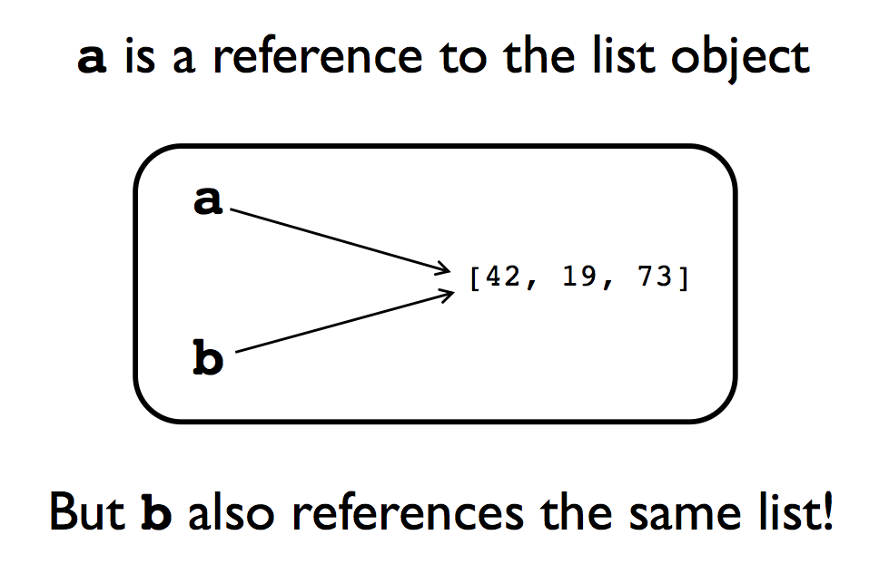
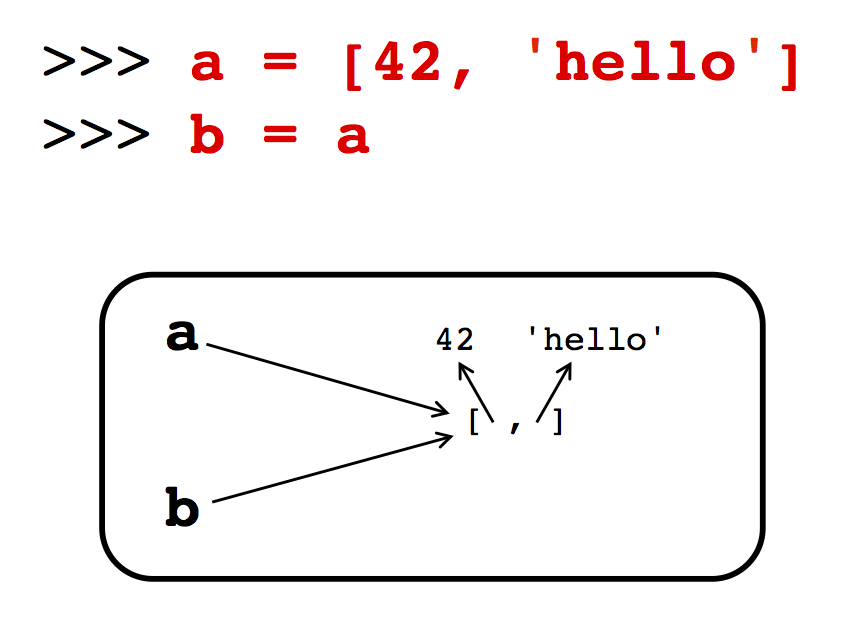
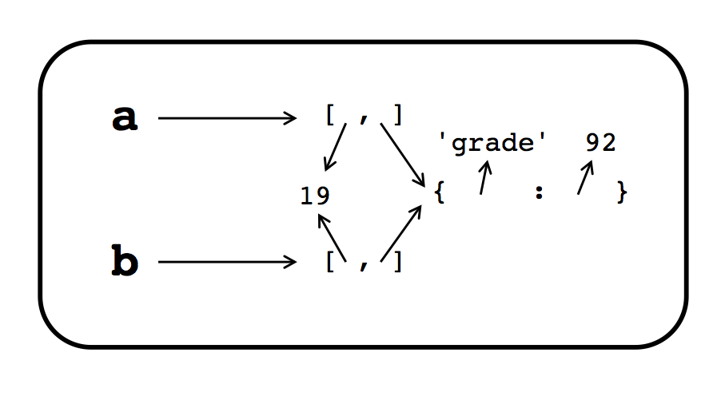
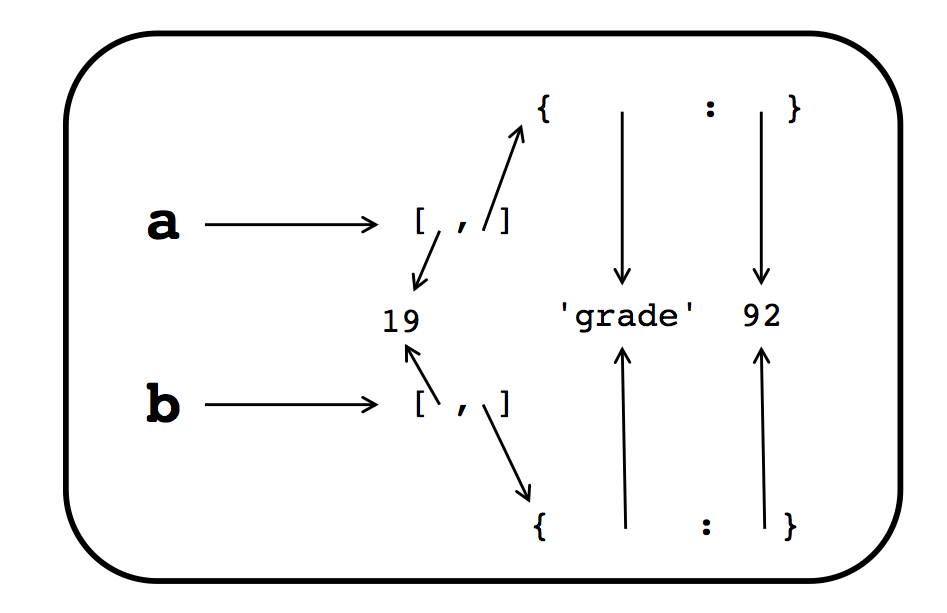

# CME 211: Lecture 7

Monday, October 5, 2015

Topics:

* Review: Python object model

* Python modules

* Python exceptions

## Announcements

* CUDA on Campus Day
<http://icme.stanford.edu/events/nvidia-tech-talks-and-hands-labs>

## Python object model

Let's review and elaborate on Python's object model.  Key things to always keep
in mind:

* everything in Python is an object

* variables in Python are references to objects

### Starting example

```py
>>> a = [42, 19, 73]
>>> b = a
>>> a
[42, 19, 73]
>>> b
[42, 19, 73]
>>> b[0] = 7   # (1.)
>>> b
[7, 19, 73]    # (2.)
>>> a
[7, 19, 73]    # (2.)
>>>
```

1. Item `b[0]` is modified

2. This action affect the object referenced by both `a` and `b`

In this example, `a` is a reference to the list object initially set to `[42,
19, 73]`.  The variable `b` also references the same list.



### Analogy

* This room is like an object

* "Geology Corner Auditorium" is an identifier that references this room

* "320-105" is also an identifier that references this same room

### Objects and references

* Names or identifiers point to or reference an object

* Identifiers are untyped and dynamic (an identifier can reference an integer,
and then reference a string)

```py
>>> a = 5
>>> a = 'hi'
```

* But Python is also strongly typed: you can't add a number and a string because
that doesn't make sense

* Everything in Python is an object: numbers, strings, functions, etc. are all
objects

* An object is a location in memory with a type and a value

### Assignment

* The assignment operation, `=`, can be interpreted as setting up the reference

```py
>>> a = 'hello'
```

1) Create a string object containing `'hello'`

2) Point the identifier a to the newly created string object

### Example


### Example


### Checking references

We can check if two names reference the same object with the `is` operator:

```py
>>> a = [42, 19, 73]
>>> b = a
>>> a is b
True
>>> b = [42, 19, 73]
>>> a is b
False
>>>
```

### Integers and references

Integers are objects also and need to be created in memory:

```py
>>> a = 1024
>>> b = a
>>> a is b
True
>>> a = 1024
>>> b = 1024
>>> a is b
False
>>> a = 16
>>> b = 16
>>> a is b
True
>>>
```

### Preallocated integers

* For interactive usage, Python preallocates permanent integer objects for the
  values `-5` to `256`

* Instead of constantly creating / destroying these objects they are
  permanently maintained

* Integers outside this range are created / destroyed as needed

```py
>>> a = -6
>>> b = -6
>>> a is b
False
>>> a = -5
>>> b = -5
>>> a is b
True
>>> a = 256
>>> b = 256
>>> a is b
True
>>> a = 257
>>> b = 257
>>> a is b
False
>>>
```

### String reuse

String objects may be "reused" internally:

```py
>>> a = 'hello'
>>> b = 'hello'
>>> a is b
True
>>>
```

### Why immutables?

* It's a design decision not uncommon in other languages (e.g. strings are
  immutable in Java)

* Allows for performance optimizations

* Can setup storage for a string once because
it never changes

* Dictionary keys required to be immutable for performance optimizations to
  quickly locate keys

### Containers and element references

* The elements in a list, or the key and value pairs in a dictionary, contain
  references to objects

* Those references can be to "simple" data types like a number or string, or
  more complicated data types like other containers

* There are some restrictions, for example the key objects in a dictionary must
  be immutable (e.g. numbers, strings, or tuples)

### Containers and element references

```py
>>> a = [42, 'hello']
>>> b = a
```



### Copying a list

* Simple assignment does not give us a copy
of a list, only an additional reference to the
same list


* What if we really want an additional copy
that can be modified without changing the
original?

### Shallow copy

```py
>>> a = [42, 'hello']
>>> import copy
>>> b = copy.copy(a)
```


* Constructs a new list and inserts references to
the objects referenced in the original

### Shallow copies and mutables

```py
>>> a = [19, {'grade':92}]
>>> b = copy.copy(a)
>>> a
[19, {'grade': 92}]
>>> b
[19, {'grade': 92}]
>>> a[1]['grade'] = 97
>>> a
[19, {'grade': 97}]
>>> b
[19, {'grade': 97}]
>>>
```



### Deep copy

```py
>>> a = [19, {'grade':92}]
>>> b = copy.deepcopy(a)
>>> a
[19, {'grade': 92}]
>>> b
[19, {'grade': 92}]
>>> a[1]['grade'] = 97
>>> a
[19, {'grade': 97}]
>>> b
[19, {'grade': 92}]
>>>
```



* Constructs a new list and inserts copies of the
objects referenced in the original

### Tuples and immutability

```py
>>> a = [42, 'feed the dog', 'clean house']
>>> import copy
>>> b = copy.copy(a)
>>> c = (a,b)
>>> c
([42, 'feed the dog', 'clean house'], [42, 'feed the dog', 'clean house'])
```

```py
>>> b[0] = 7
>>> c
([42, 'feed the dog', 'clean house'], [7, 'feed the dog', 'clean house'])
>>> c[0][0] = 7
>>> c
([7, 'feed the dog', 'clean house'], [7, 'feed the dog', 'clean house'])
```

```py
>>> c[0] = [73, 'wash dishes', 'do laundry']
Traceback (most recent call last):
File "<stdin>", line 1, in <module>
TypeError: 'tuple' object does not support item assignment
>>>
```


The immutable property of tuples only means I can't change where the arrows
point, I'm still free to change a mutable at the arrow destination

### Memory management

* What happens to those objects that are no longer referenced?


### Garbage collection

* Unreachable objects are garbage collected

* Garbage collection in Python is implemented with reference counting


## Python modules

## Python exceptions
