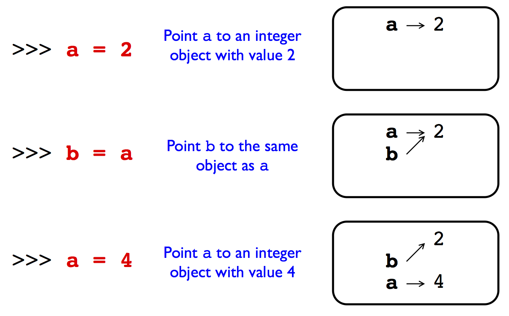
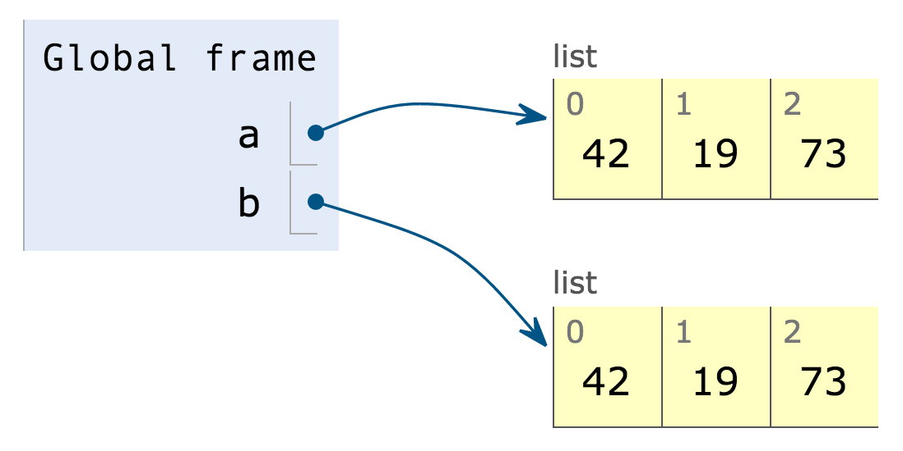
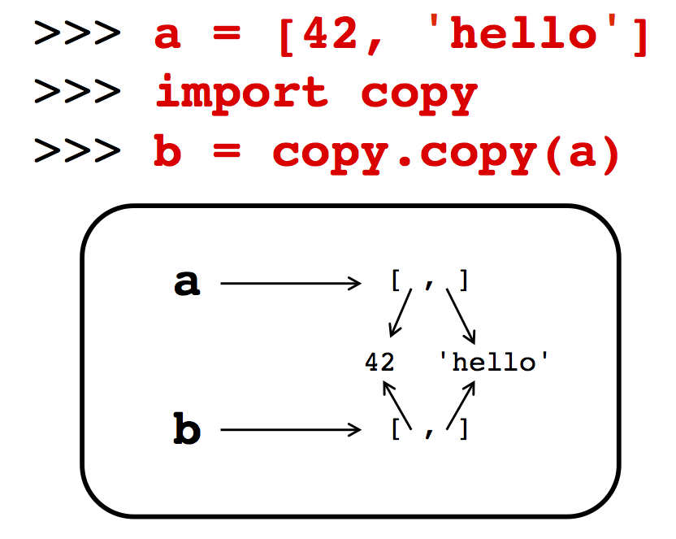

# CME 211: Lecture 7

## Topics

* Python object model

* Python modules

* Python exceptions

## Python object model

Let's review and elaborate on Python's object model.  Key things to always keep
in mind:

* everything in Python is an object

* variables in Python are references to objects

### Starting example

```python
a = [42, 19, 73]
b = a
print(a)
print(b)
```

```python
b[0] = 7   # (1.)
print(b)   # (2.)
print(a)   # (2.)
```

1. Item `b[0]` is modified

2. This action affects the object referenced by both `a` and `b`

In this example, `a` is a reference to the list object initially set to `[42,
19, 73]`.  The variable `b` also references the same list.


### Analogy

* This room is like an object

* "Geology Corner Auditorium" is an identifier that references this room

* "320-105" is also an identifier that references this same room

### Objects and references

* Names or identifiers point to or reference an object

* Identifiers are untyped and dynamic (an identifier can reference an integer,
  and then reference a string)

```python
a = 5
a = 'hi'
```

* But Python is also strongly typed: you can't add a number and a string because
  that doesn't make sense

* Everything in Python is an object: numbers, strings, functions, etc. are all
  objects

* An object is a location in memory with a type and a value

### Assignment

The assignment operation, `=`, can be interpreted as setting up a reference.

We can interpret the code:

```python
a = 'hello'
```

as:

1. creating a string object containing `'hello'`

2. setting the identifier `a` to refer to the newly created string object

### Example



### Example


### Checking references

We can check if two names (variables) reference the same object with the `is`
operator:

```python
a = [42, 19, 73]
b = a
print(a is b)
```

In memory we have:


```python
b = [42, 19, 73]
print(a is b)
```

In memory we have:



Check it out in [Python Tutor][pytut-ex-list].

[pytut-ex-list]: http://www.pythontutor.com/visualize.html#code=a%20%3D%20%5B42,%2019,%2073%5D%0Ab%20%3D%20a%0Aprint(a%20is%20b%29%0Ab%20%3D%20%5B42,%2019,%2073%5D%0Aprint(a%20is%20b%29%0A&cumulative=false&curInstr=0&heapPrimitives=false&mode=display&origin=opt-frontend.js&py=3&rawInputLstJSON=%5B%5D&textReferences=false

### Integers and references

Integers are objects also and need to be created in memory.  Let's explore this
a bit.

```python
a = 1024
b = a
a is b
```

```python
a = 1024
b = 1024
a is b
```

```python
a = 16
b = 16
a is b
```

In the last code block, `a` and `b` point to the same object, because Python
preallocates some integers.

### Preallocated integers

* For interactive usage, Python preallocates permanent integer objects for the
  values `-5` to `256`

* Instead of constantly creating / destroying these objects they are
  permanently maintained

* Integers outside this range are created / destroyed as needed

```python
a = -6
b = -6
a is b
```

```python
a = -5
b = -5
a is b
```

```python
a = 256
b = 256
a is b
```

```python
a = 257
b = 257
a is b
```

### String reuse

String objects may be "reused" internally:

```python
a = 'hello'
b = 'hello'
a is b
```

### Why immutables?

* It's a design decision not uncommon in other languages (e.g. strings are
  immutable in Java)

* Allows for performance optimizations

* Can setup storage for a string once because it never changes

* Dictionary keys required to be immutable for performance optimizations to
  quickly locate keys

### Containers and element references

* The elements in a list, or the key and value pairs in a dictionary, contain
  references to objects

* Those references can be to "simple" data types like a number or string, or
  more complicated data types like other containers

* There are some restrictions, for example the key objects in a dictionary must
  be immutable (e.g. numbers, strings, or tuples)

### Containers and element references

```python
a = [42, 'hello']
b = a
```


### Copying a list

* Simple assignment does not give us a copy of a list, only an additional
reference to the same list

* What if we really want an additional copy that can be modified without changing
the original?

#### Shallow copy

```python
a = [42, 'hello']
import copy
b = copy.copy(a)
```



A shallow copy (`copy.copy`) constructs a new list and inserts references to the
objects referenced in the original.

#### Shallow copies and mutables

```python
a = [19, {'grade':92}]
b = copy.copy(a)
print(a)
print(b)
```

```python
a[0] = 42
a[1]['grade'] = 97
print(a)
print(b)
```


#### Deep copy

```python
a = [19, {'grade':92}]
b = copy.deepcopy(a)
print(a)
print(b)
```

```python
a[0] = 42
a[1]['grade'] = 97
print(a)
print(b)
```


A deep copy (`copy.deepcopy`) constructs a new list and inserts copies of the
objects referenced in the original.  It will copy all nested data structures.

### Tuples and immutability

```python
a = [42, 'feed the dog', 'clean house']
import copy
b = copy.copy(a)
c = (a,b)
c
([42, 'feed the dog', 'clean house'], [42, 'feed the dog', 'clean house'])
```

```python
b[0] = 7
print(c)
c[0][0] = 7
print(c)
```

```python
c[0] = [73, 'wash dishes', 'do laundry']
```


The immutable property of tuples only means I can't change where the arrows
point, I'm still free to change a mutable object at the arrow destination.

### Memory management

* What happens to those objects that are no longer referenced?


### Garbage collection

* Unreachable objects are garbage collected

* Garbage collection in Python is implemented with reference counting


### Recommended Reading

* Chapter 6: The Dynamic Typing Interlude
